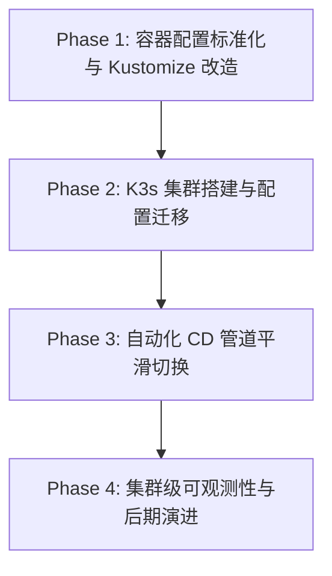

## 背景

当前，xiaolinstar 旗下各项目（如 `xiaolin-gateway`、`ai-todo`、`party-helper`、`drink-budget` 等）的
DevOps 实践已被定义为 **v1 版本**。其核心特点为：虚拟机主机（VPS） + `docker-compose` 容器化 +
GitHub Actions（推式 CD 登录 VPS 重启）。
随着项目增多，多项目管理下面面临以下运维痛点：

1. **容器缺乏原生自愈与弹缩性**：发生故障时依赖外部探活和人工/Agent 干预重启，没有原生的健康检查与滚动无损升级。
2. **静态网关与路由管理**：路由和反向代理在 `xiaolin-gateway` 宿主机侧使用 Nginx/compose 静态配置，域名与路由规则分散，无法随服务的发布而动态声明。
3. **配置与密钥（L3）依赖宿主机文件系统**：需要手动在各个宿主机维护 `local.env` 和 `production.env`。
   尽管引入了 `~/.config/xiaolinstar` 统一管理与 `sync.sh` 脚本校验，但本质上依然属于宿主机上的静态配置，
   无法在部署时以声明式对象（K8s ConfigMap/Secret）统一挂载和注入。
4. **推式 CD 的 SSH 密钥安全面**：GitHub Actions 存有各个 VPS 的 SSH 密码/私钥凭据，通过远程执行 Shell 指令进行 CD，凭据暴露面大。

我们需要将 DevOps v1 的架构特点进行归档，并制定一个以 **K3s + Kustomize** 为核心的轻量级云原生演进方案（v2 版本），以便在降低运维复杂度的同时，避免直接引入 Argo CD/Flux 等复杂 GitOps 工具链带来的过度工程（Overengineering）。

## 决策

### 1. 归档 DevOps v1 架构

DevOps v1 架构的运行机制及定义如下：

- **基础设施**：云厂商 VPS 虚拟机（Ubuntu 等）。
- **容器编排**：各服务独立拥有 `docker-compose.yml`，在各自物理机器 of 独立目录中运行。
- **配置模型**：L0-L3 环境配置治理模型。L3 为宿主机磁盘上的 `.env` 文件，由 `dev-standards` 标准库中的 `sync.sh env check` 进行格式比对。
- **CD 交付**：推式交付。GitHub Actions 挂载 L2 级 `DEPLOY_PASSWORD` / `DEPLOY_SSH_KEY`，
  在 CI 通过后使用 SSH 登录 VPS 执行 `docker pull` 与 `docker-compose up -d`。
- **服务网关**：单点宿主机 Nginx 容器（`xiaolin-gateway`），负责域名解析与请求路由转发。

### 2. 定义 DevOps v2 目标架构 (K3s + Kustomize)

DevOps v2 将以“轻量、声明式、原生自愈”为原则，目标技术栈选型如下：

- **运行底座：K3s 单节点/轻量集群**
  - **原因**：K3s 相比标准 Kubernetes (K8s) 极度轻量，内存消耗低（通常 < 1GB），
    且开箱即用（内置 Traefik 作为 Ingress，提供本地存储，默认使用 SQLite 替代 Etcd），完全契合单人/小团队多项目宿主机环境。
- **配置与编排：Kustomize (kubectl 内置)**
  - **原因**：Kustomize 无需 Helm 繁琐的模板编写与 Chart 托管。它通过原生 YAML 进行修改（Base + Overlays），
    支持自动生成 ConfigMap/Secret 的 Hash 后缀（配置更新自动触发 Pod 重启），是声明式多环境管理的最佳实践。
- **部署模式：GitHub Actions + kubectl 推式更新**
  - **原因**：暂时不引入 Argo CD/Flux。保持原有的 GitHub Actions 工作流作为统一入口，利用 kubeconfig 凭证与 K3s 通信。
    CD 步骤从 `ssh && docker-compose` 替换为 `kubectl apply -k <overlay>`，兼顾“推式部署的直接性”与“声明式部署的自愈性”。
- **网关接管：K8s Ingress Controller (Traefik)**
  - **原因**：用 K8s 原生 Ingress 资源取代静态 Nginx 反向代理配置。
    域名与路由规则直接写在 Kustomize 配置文件中，服务部署时路由自动生效，网关逻辑下沉到集群中。

### 3. K8s (v2) 演进路线图

演进分为四个阶段，逐步平滑迁移，避免服务中断。

#### Phase 1: 容器配置标准化与 Kustomize 改造

1. **Dockerfile 规范化**：所有应用支持标准 Docker 镜像构建，并暴露规范的健康检查接口（如 `/healthz`）。
2. **Kustomize 脚手架建立**：在各个应用仓库中创建 `deploy/k8s` 目录：
   - `base/`：包含通用的 Deployment、Service 和 Ingress 基本骨架。
   - `overlays/staging/` 和 `overlays/production/`：包含针对不同环境的特定副本数、域名和环境变量补丁（Patches）。
3. **配置与敏感信息映射**：定义如何在 overlays 中利用 `secretGenerator` 和 `configMapGenerator` 组装配置文件。

#### Phase 2: K3s 集群搭建与配置迁移

1. **单机 K3s 部署**：在 VPS 上运行 K3s 安装脚本，暴露集群的 API 接口，配置安全组。
2. **L3 配置入库 K8s**：
   - 将原来保存在宿主机 `~/.config/xiaolinstar/` 的真实 `.env` 变量导入为 Kubernetes 的 **Secret** 和 **ConfigMap** 对象。
   - 探寻密钥持久化备份方案，防范集群重建丢失（如使用本地 SOPS 加密备份或单机密钥同步工具）。
3. **域名路由迁移**：在 K3s 内配置 Ingress 规则，将原 Nginx（`xiaolin-gateway`）的域名逐步分流至 K3s 的 Ingress 网关。

#### Phase 3: 自动化 CD 管道平滑切换

1. **GitHub Actions 凭证更新**：
   - 废弃原 L2 中的 SSH 密码/私钥（`DEPLOY_PASSWORD` / `DEPLOY_SSH_KEY`）。
   - 在 GitHub Settings 中添加 `KUBECONFIG` 凭证（只读或受限修改部署命名空间的权限），以实现安全连接。
2. **CD 脚本替换**：
   - 替换 Actions 中原有的 SSH 登录发布任务。
   - 新增 `kubectl` 命令任务：`kubectl apply -k deploy/k8s/overlays/production`。
3. **滚动发布与回滚验证**：利用 K8s 内置 of `rollout` 机制验证滚动升级与一键回滚。

#### Phase 4: 集群级可观测性与后期演进

1. **轻量级集群监控**：在 K3s 内部署轻量级 Metrics Server，支持 `kubectl top` 查看资源。
2. **日志与警报集中化**：引入轻量级日志收集（如 Fluent-Bit 收集容器 stdout 并写入持久化存储），并在发生 Pod Crash 时发送通知。
3. **远期 GitOps 评估**：当微服务仓库数量超过 5 个且多人协作时，再评估是否在 K3s 中启动 ArgoCD 转向拉式 GitOps。

### 4. 本地联调最佳实践 (Local Dev & Test Best Practices)

为了保证本地开发环境与生产环境网络拓扑的高度一致性，规避“本地联调绕过网关，线上部署报错”的架构漂移问题，统一本地联调规范：

1. **本地域名隔离**：本地联调禁止使用公网生产域名（如 `xingxiaolin.cn`），必须使用 IETF 规定的保留本地域名
   （如 `*.localhost` 或 `*.test`）。这能规避 DNS 泄漏、公网数据污染，且浏览器对 `*.localhost` 会默认解析到 `127.0.0.1`。
2. **网关代理收拢**：废弃前端开发服务器（如 Vite/Webpack）自带的 Node.js Proxy 配置（如 `server.proxy`）。
   - 本地必须拉起轻量级网关容器（`xiaolin-gateway`，通过映射非标端口如 `8880`/`8443` 避免物理端口冲突）。
   - 前端与小程序的 API 基址（`API_BASE_URL`）一律指向本地网关地址（如 `https://todo-api.localhost:8443`），由本地网关 Nginx 统一进行反向代理和分流。
   - 这能确保 CORS、安全标头（Security Headers）、Cookie 策略等在本地开发期就得到与生产环境 100% 一致的验证。

## 后关

- **运维复杂度降低**：告别了繁琐的物理机端口管理和容器重启命令，完全依托 K8s 的自愈与声明式配置。
- **规范体系演进**：[ci-minimum-gate.md](../ci-minimum-gate.md) 与 [env-management.md](../env-management.md)
  将逐步更新 K8s 对应的规范段（如 K8s 原生健康检查、Secret 挂载映射规范）。
- **迁移期成本**：需要一定的学习曲线来熟悉 K8s 常用排障命令（如 `kubectl logs`，`kubectl describe`）。

## 参考

- [env-management.md](../env-management.md)
- [ci-minimum-gate.md](../ci-minimum-gate.md)
- [ADR-0003](0003-12-factor-adaptation.md) Config 分层
